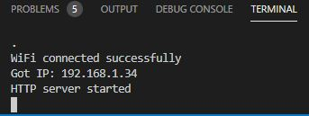
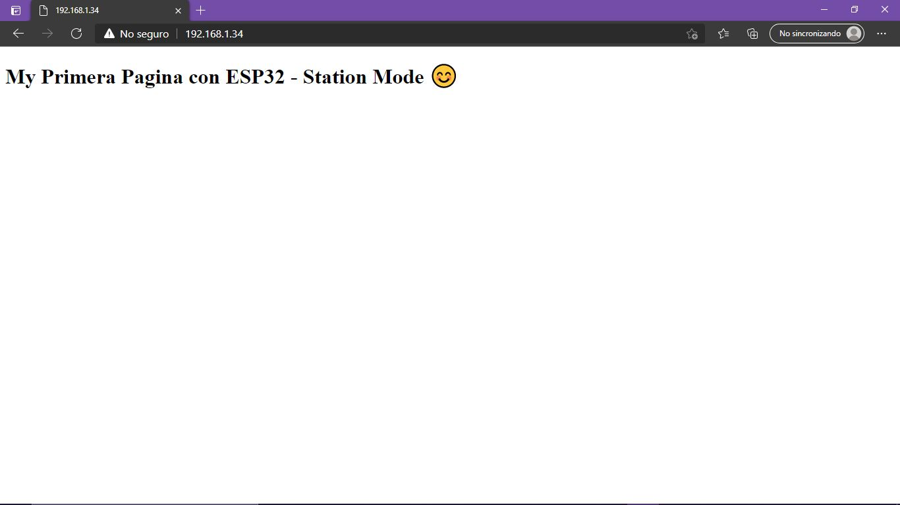
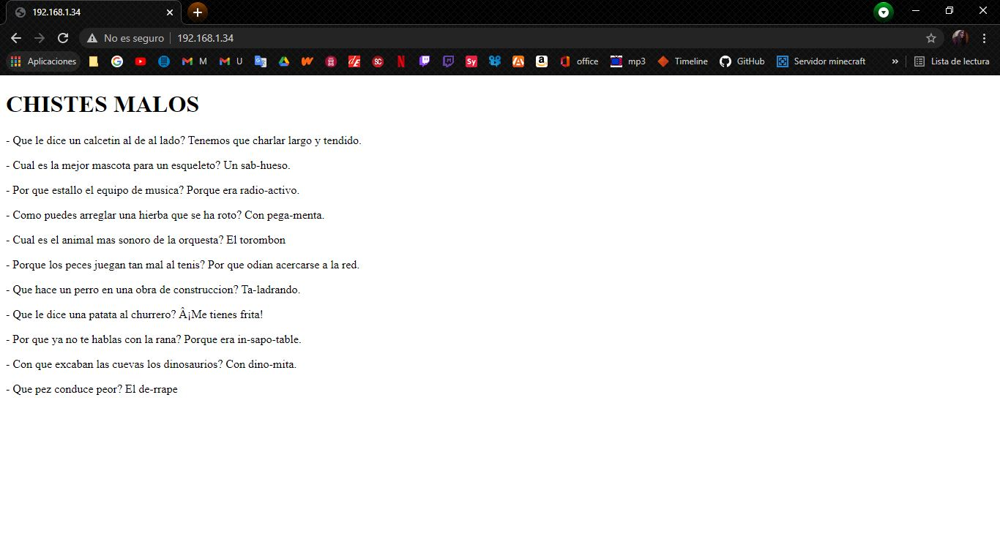

# PRÁCTICA 3: Generación de una pagina web

## CÓDIGO:
```
#include <Arduino.h>
#include <WiFi.h>
#include <WebServer.h>
// SSID & Password
const char* ssid = "****"; // Enter your SSID here
const char* password = "****"; //Enter your Password here
WebServer server(80); // Object of WebServer(HTTP port, 80 is defult)

void handle_root(void);

void setup() {
Serial.begin(115200);
Serial.println("Try Connecting to ");
Serial.println(ssid);

// Connect to your wi-fi modem
WiFi.begin(ssid, password);

// Check wi-fi is connected to wi-fi network
while (WiFi.status() != WL_CONNECTED) {
  delay(1000);
  Serial.print(".");
}

Serial.println("");
Serial.println("WiFi connected successfully");
Serial.print("Got IP: ");
Serial.println(WiFi.localIP()); //Show ESP32 IP on serial
server.on("/", handle_root);
server.begin();
Serial.println("HTTP server started");
delay(100);
}

void loop() {
  server.handleClient();
}

// HTML & CSS contents which display on web server
String HTML = "<!DOCTYPE html>\
<html>\
<body>\
<h1>My Primera Pagina con ESP32 - Station Mode &#128522;</h1>\
</body>\
</html>";

// Handle root url (/)
void handle_root() {
  server.send(200, "text/html", HTML);
}

```

## FUNCIONAMENT:
Se trata de un programa para crear una página web. Para esto necesitamos inicialment connectar nuestra placa a una red Wi-Fi:

```
const char* ssid = "****"; // Enter your SSID here
const char* password = "****"; //Enter your Password here
WebServer server(80); // Object of WebServer(HTTP port, 80 is defult)

void handle_root(void);

void setup() {
Serial.begin(115200);
Serial.println("Try Connecting to ");
Serial.println(ssid);

// Connect to your wi-fi modem
WiFi.begin(ssid, password);

// Check wi-fi is connected to wi-fi network
while (WiFi.status() != WL_CONNECTED) {
  delay(1000);
  Serial.print(".");
}

Serial.println("");
Serial.println("WiFi connected successfully");
Serial.print("Got IP: ");
Serial.println(WiFi.localIP()); //Show ESP32 IP on serial
server.on("/", handle_root);
server.begin();
Serial.println("HTTP server started");
delay(100);
}
```
Vuando la red Wi-Fi este conectada a la placa esta va lanzar una respuesta por pantalla (printeando), diciendo que el dispositivo ya esta conectdo a la red.

Seguidamente necesitamos crear el contenido de la página. Para generarla utilizaremos código html:
```
void loop() {
  server.handleClient();
}

// HTML & CSS contents which display on web server
String HTML = "<!DOCTYPE html>\
<html>\
<body>\
<h1>My Primera Pagina con ESP32 - Station Mode &#128522;</h1>\
</body>\
</html>";

// Handle root url (/)
  void handle_root() {
  server.send(200, "text/html", HTML);
}
```

Una vez introducido todo hay que subir el código a la placa, y una vez monitorizado el programa obtendremos la IP de nuestro ordenador:



Esta IP al ponerla en el buscador de nuestro dispositivo nos va a llevar a la página web que hemos creado anteriormente:



Cda vez que una persona se conecte a la página el código nos va a mostrar un mensaje diciendonos que una persona se ha connectado "[E][WebServer.cpp:632] _handleRequest(): request handler not found".

## NUEVA PÁGINA:
```
#include <Arduino.h>
#include <WiFi.h>
#include <WebServer.h>
// SSID & Password
const char* ssid = "FRITZBox 7530 AA"; // Enter your SSID here
const char* password = "29204458007338454923"; //Enter your Password here
WebServer server(80); // Object of WebServer(HTTP port, 80 is defult)

void handle_root(void);

void setup() {
Serial.begin(115200);
Serial.println("Try Connecting to ");
Serial.println(ssid);

// Connect to your wi-fi modem
WiFi.begin(ssid, password);

// Check wi-fi is connected to wi-fi network
while (WiFi.status() != WL_CONNECTED) {
  delay(1000);
  Serial.print(".");
}

Serial.println("");
Serial.println("WiFi connected successfully");
Serial.print("Got IP: ");
Serial.println(WiFi.localIP()); //Show ESP32 IP on serial
server.on("/", handle_root);
server.begin();
Serial.println("HTTP server started");
delay(100);
}

void loop() {
  server.handleClient();
}

// HTML & CSS contents which display on web server
String HTML = "<!DOCTYPE html>\
<html>\
<body>\
<h1> CHISTES MALOS </h1>\
<p> - Que le dice un calcetin al de al lado? Tenemos que charlar largo y tendido. </p>\
<p> - Cual es la mejor mascota para un esqueleto? Un sab-hueso. </p>\
<p> - Por que estallo el equipo de musica? Porque era radio-activo. </p>\
<p> - Como puedes arreglar una hierba que se ha roto? Con pega-menta. </p>\
<p> - Cual es el animal mas sonoro de la orquesta? El torombon </p>\
<p> - Porque los peces juegan tan mal al tenis? Por que odian acercarse a la red. </p>\
<p> - Que hace un perro en una obra de construccion? Ta-ladrando. </p>\
<p> - Que le dice una patata al churrero? ¡Me tienes frita! </p>\
<p> - Por que ya no te hablas con la rana? Porque era in-sapo-table. </p>\
<p> - Con que excaban las cuevas los dinosaurios? Con dino-mita. </p>\
<p> - Que pez conduce peor? El de-rrape </p>\
</body>\
</html>";

// Handle root url (/)
void handle_root() {
  server.send(200, "text/html", HTML);
}
```

Modificando el código anterior de la anterior página web, generado con código con el lenguage html, he crado una nueva página web, en este caso con chistes malos. Esta página consta de un titulo y varios párrafos que es donde estan los chistes.

